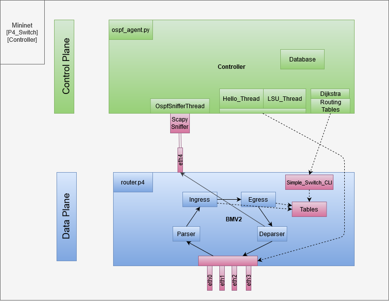

# Routing dynamiczny - opis rozwiązania

[TOC]

## Wstęp

Rozwiązanie zakłada implementację prostego Routera IP działającego na przełączniku [*BMV2*](https://github.com/p4lang/behavioral-model). Warstwa przekazu danych jest warstwą programowalną, implementowaną z użyciem języka P4_16.  Należy zapewnić działanie protokołu [*Pee-Wee OSPF*](https://www.cl.cam.ac.uk/teaching/1011/P33/documentation/pwospf/), który jest uproszczoną implementacją protokołu OSPF oraz odpowiednią integrację warstwy danych z warstwą sterowania. 



## Warstwa przekazu danych

Warstwa przekazu danych bazuje na kodzie zaimplementowanym w części routingu statycznego. Została uzupełniona o rozpoznanie, że przekazywana wiadomość jest wiadomością OSPF oraz przekazanie jej do obsługi w warstwie sterowania.

### Rozpoznanie wiadomości OSPF

Wiadomości OSPF są rozpoznawane na podstawie pola ``protocol`` w nagłówku ``ipv4``.

```c
const bit<8> TYPE_OSPF = 0x59;

```

Dzieje się to na etapie parsowania pól nagłówka wiadomości ``ipv4``, tak jak widoczne poniżej. W tzw. metadanych jest przekazywana zmienna typu bool - `isOSPF`. 

```C
state parse_ipv4 {
    packet.extract(hdr.ipv4);
    transition select(hdr.ipv4.protocol){
        TYPE_OSPF: ospf_state;
        default: accept;
    }
}
state ospf_state {
    meta.isOSPF = true;
    transition accept;
}
```

*Uwaga: Pola wiadomości OSPF nie są parsowane w programie P4. Ich rozpoznanie jest wykonywane w warstwie sterowania.*  

### Odwołanie do warstwy sterowania

W bloku `MyIngress` podejmowana jest decyzja którą z tablic routingu IP zastosować dla przychodzącego pakietu. Jeśli pakiet zawiera wiadomość OSPF (`isOSPF==true`) aplikowana jest tablica `cp_forward_table`. 

Tablica `cp_forward_table` jest prostą tablicą, która kieruje wiadomości OSPF do obiektu typu Controller w środowisku Mininet. Interfejs wyjściowy to specjalny interfejs utworzony na każdym Switchu na potrzeby przekazywania wiadomości do warstwy sterowania. Adres docelowy jest ustawiany jako interfejs obiektu Controller. 

Wpisy do tablicy `cp_forward_table` przedstawiają się następująco:

```
table_set_default MyIngress.cp_forward_table NoAction
table_add MyIngress.cp_forward_table to_port_forward 0.0.0.0/0 => 4
```

Są one aplikowane do switcha z użyciem `simple_switch_CLI` i specyficznego `thrift-port'u`. Skutkiem zadziałania pokazanej reguły jest przekazanie każdego pakietu OSPF na port 4 switch'a. Za to przekazanie odpowiada akcja `to_port_forward`:

```C
action to_port_forward(bit<9> port){
        hdr.ipv4.ttl = hdr.ipv4.ttl - 1;
        standard_metadata.egress_spec = port;
    }
```

W bloku `MyEgress` pakiety OSPF są obsługiwane w taki sam sposób jak każdy inny pakiet IP (tak jak w części statycznej projektu): aplikowane są tablice `switch_table` oraz `mac_rewriting_table`, chociaż nie ma to znaczenia w kontekście dalszej obsługi tego pakietu w warstwie sterowania.

### Zabezpieczenie przed zapętleniem pakietów - obsługa pakietów przychodzących z warstwy sterowania

Pakiety, które są generowane przez warstwę sterowania muszą być obsłużone przez warstwę danych. W tym celu sprawdzane jest, czy pakiet OSPF jest wysyłany z portu 4, który jest portem pośredniczącym w komunikacji pomiędzy warstwą sterowania a warstwą przekazu danych. Jeśli pakiet zostanie skojarzony z portem 4 poprzez wpis w tablicy `cp_inbound_table` to zostaje oznaczony jako ten, który nie powinien być ponownie kierowany na port 4 w wyniku działań z poprzedniego rozdziału.  Jest to wykonywane w bloku `MyIngress` przez akcję `mark_packet_cp`.

```
table_set_default MyIngress.cp_inbound_table NoAction
table_add MyIngress.cp_inbound_table mark_packet_cp 4 4
```

```C
action mark_packet_cp(){
        hdr.ipv4.ttl = hdr.ipv4.ttl - 1;
        meta.is_from_CP = true;
    }
```

### Integracja warstwy sterowania z warstwą przekazu danych

Tak jak wspomniano wcześniej, pakiety OSPF powinny być przekazane do obsługi przez warstwę sterowania. W tym celu został wydzielony specjalny port na switch'u służący do komunikacji pomiędzy warstwami CP i DP. Po przekierowaniu pakietu na port 4 przez warstwę przekazu danych jest on przechwytywany przez warstwę sterowania z użyciem pakietu `Scapy`. 

## Warstwa sterowania

Każdy z uruchamianych obiektów typu Switch posiada swój dedykowany obiekt typu Controller, który został wykorzystany jako środowisko uruchomieniowe dla procesów warstwy sterowania. Uruchamiane na nim oprogramowanie zostało napisane w języku Python. 

### Protokół routingu dynamicznego

Głównym celem działania programu warstwy sterowania jest zapewnienie działania protokołu routingu pakietów IP w testowanej sieci. Protokołem tym jest *Pee-Wee OSPF*, który jest uproszczoną wersją protokołu *OSPF v2*.  Zakłada on przesyłanie jedynie wiadomości typu *Hello*[1] oraz *Link State Updates*[4].

### Obsługa pakietów

Do obsługi pakietów wykorzystany został pakiet [*Scapy*](https://scapy.readthedocs.io/en/latest/). Pozwala on na uruchomienie asynchronicznego Sniffera na porcie 4 oraz wywołanie dla każdego przechwyconego pakietu specjalnie utworzonej metody w klasie `OspfSnifferThread` - `process_packet`. Zadaniem tej metody jest sprawdzenie zgodności obsługiwanego pakietu z wymaganiami protokołu *PW-OSPF*, rozpoznanie typu pakietu (*Hello* lub *LSU*) oraz wywołanie operacji na bazie danych.  Przykład tworzenia takiego Sniffera przedstawia się następująco:

```python
t = AsyncSniffer(iface=ROUTER_CP_INTERFACE.get("name"), prn=self.process_packet)
t.start()
```

Pakiet *Scapy* wraz z jego rozszerzeniem dla protokołu OSPF (zgodnym z RFC 2328) został również wykorzystany do generowania pakietów OSPF wysyłanych później do sąsiednich routerów. Generowanie takiego pakietu polega na utworzeniu kolejnych warstw i ich protokołów: MAC, IP, OSPF. Przykład tworzenia takiego pakietu jest widoczny poniżej:

```Python
p = scapy_ospf.Ether(src = ROUTER_CP_INTERFACE.get("mac"), dst = i.mac)/
	IP(src = i.ip_address, dst = i.neighbor_ip)/
	scapy_ospf.OSPF_Hdr(src=ROUTER_ID,area=AREA_ID)/
	scapy_ospf.OSPF_Hello(hellointerval=HELLOINT, deadinterval=NEIGHBOR_TIMEOUT)
```

Za tworzenie i regularne wysyłanie pakietów *Hello* oraz *LSU* odpowiedzialne są odpowiednio klasy `OspfHelloThread` oraz `OspfLSUThread`. Ponieważ rozszerzenia Scapy dla OSPF przewidują znacznie bardziej rozbudowane wiadomości niż w *Pee-Wee OSPF*, to wykorzystane zostały tylko niektóre z udostępnianych przez API pól. Pozostałe pola są przesyłane z domyślnie generowanymi wartościami, a po stronie odbiorczej parsowane są tylko te, które są właściwe dla *PW-OSPF*. 

### Baza danych

Baza danych, czyli `DatabaseClass` dziedziczy po obiekcie typu lista. Wewnątrz listy przechowywane są słowniki. Każdy słownik odpowiada Routerowi, od którego otrzymano wiadomość *Hello*. Oprócz tego, wewnątrz list, pod kluczem `"lsu"`przechowywany jest słownik definiujący łącza, które rozgłosił dany router, wraz z ID routera, od którego do rozgłoszenie pochodzi. 

Jeśli przychodząca wiadomość *Hello* pochodzi od Routera, który znajduje się już w bazie, to aktualizowany jest dla niego znacznik czasowy, oznaczający, że dany Router można uznawać za "działający". 

### Wątki

Wspomiane do tej pory klasy `OspfHelloThread` oraz `OspfLsuThread` dziedziczą po klasie `Thread`. Tak samo jest z klasą `TimerThread` służącą do monitorowania czasu od ostatniej wiadomości *Hello*, która, jeśli Router nie ponawia swojego statusu przez okres zdefiniowany jako `NEIGHBOR_TIMEOUT`, wykreśla go z bazy danych. 

Wymienione wątki są tworzone i uruchamiane na początku działania programu. 

###  Struktura programu

Kompletne oprogramowanie składa się z 5 plików `ospf_agentX.py`, które powinny być uruchomione na każdym z Controller'ów. Na początku każdego skryptu zdefiniowane są dane konfiguracyjne - takie same, jak w pliku `topology.py`, służącym do skonfigurowania i uruchomienia sieci w programie Mininet. 

W funkcji `main`, pomiędzy poleceniami tworzącymi i determinującymi kolejne obiekty, znajduje się polecenie `time.sleep()`. Od wartości przekazanej w funkcji `sleep` zależy czas przez który program będzie uruchomiony. 

### Warstwa sterowania #ToDo

Na podstawie tworzonej bazy danych program powinien utworzyć graf sieci i wykorzystując algorytm Dijkstry wyznaczyć najkrótsze ścieżki. Następnie powinien wygenerować na tej podstawie wpisy do tablic routingu, które należy wykonać z wykorzystaniem linii komend *Simple_Switch_CLI*. 

Przykład wygenerowanych wpisów:

```
table_set_default MyIngress.cp_routing_table NoAction
table_set_default MyEgress.cp_switching_table NoAction
table_set_default MyEgress.cp_mac_rewriting_table NoAction

table_add MyIngress.cp_routing_table ipv4_forward 0.0.0.0/24 => 192.168.102.1    1
table_add MyEgress.cp_switching_table set_dmac 192.168.102.1 => 00:00:00:02:00:00
table_add MyEgress.cp_mac_rewriting_table set_smac 1 => 00:00:00:00:02:04
```

Jak widać powyżej, wpisy te odnoszą się do tablic oraz akcji utworzonych w programie P4 warstwy przekazu danych. 

## Sieć testowa

Sieć testowa zostanie zestawiona za pomocą środowiska *Mininet*. Routery działające w tym środowisku to switche *BMV2* z uruchomionym programem P4.  Sieć składa się z 5 Routerów oraz 3 Hostów. Ścieżka do każdej podsieci jest redundantna. 

Każdy switch ma przypisany swój obiekt typu Controller z wydzielonym adresem IP. Każdy switch ma utworzony specjalny interfejs `sX-eth4`. Controller oraz wspomniany interfejs są ze sobą połączone. 


