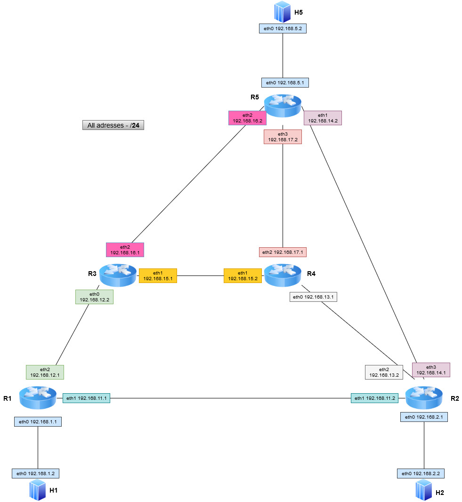

# Routing dynamiczny - opis rozwiązania

## Wstęp

Rozwiązanie zakłada implementację prostego Routera IP działającego na przełączniku [*BMV2*](https://github.com/p4lang/behavioral-model). Warstwa przekazu danych jest warstwą programowalną, implementowaną z użyciem języka P4_16.  Należy zapewnić działanie protokołu [*Pee-Wee OSPF*](https://www.cl.cam.ac.uk/teaching/1011/P33/documentation/pwospf/), który jest uproszczoną implementacją protokołu OSPF oraz odpowiednią integrację warstwy danych z warstwą sterowania. 

## Warstwa przekazu danych

Warstwa przekazu bazuje na kodzie zaimplementowanym w części routingu statycznego. Została uzupełniona o rozpoznanie, że przekazywana wiadomość jest wiadomością OSPF oraz przekazanie jej do obsługi w warstwie sterowania.

### Rozpoznanie wiadomości OSPF

Wiadomości OSPF są rozpoznawane na podstawie pola ``protocol`` w nagłówku ``ipv4``.

```c
const bit<8> TYPE_OSPF = 0x59;
```

Dzieje się to na etapie parsowania pól nagłówka wiadomości ``ipv4``, tak jak widoczne poniżej. W tzw. metadanych jest przekazywana zmienna typu bool - `isOSPF`. 

```c
state parse_ipv4 {
    packet.extract(hdr.ipv4);
    transition select(hdr.ipv4.protocol){
        TYPE_OSPF: ospf_state;
        default: accept;
    }
}

state ospf_state {
    meta.isOSPF = true;
    transition accept;
}
```

*Uwaga: Pola wiadomości OSPF nie są parsowane w programie P4. Ich rozpoznanie jest wykonywane w warstwie sterowania.*  

### Odwołanie do warstwy sterowania

W bloku `MyIngress` podejmowana jest decyzja którą z tablic routingu IP zastosować dla obsługiwanego pakietu. Jeśli pakiet zawiera wiadomość OSPF (`isOSPF==true`) aplikowana jest tablica `cp_routing_table`. Dla każdej innej stosujemy tablicę `routing_table`.

Tablica `cp_routing_table` jest prostą tablicą, która kieruje wiadomości OSPF do obiektu typu Controller w środowisku Mininet. Interfejs wyjściowy to specjalny interfejs utworzony na każdym Switchu na potrzeby przekazywania wiadomości do warstwy sterowania. Adres docelowy jest ustawiany jako interfejs obiektu Controller. 

*Uwaga: Każdemu Switch'owi odpowiada oddzielny obiekt Controller. Każdy switch ma inne wpisy w tablicy* `cp_routing_table`.

Takie samo działanie jest podejmowanie w celu ustawienia odpowiednich adresów MAC - źródłowego oraz docelowego. Gdy pakiet zawiera wiadomość OSPF aplikowane są tablice `cp_switching_table` oraz `cp_mac_rewriting_table `. W przeciwnym razie są to odpowiednio `switching_table` oraz `mac_rewriting_table `.

Przykład wpisów do tablic `cp_%` przedstawiają się następująco: 

```
table_set_default MyIngress.cp_routing_table NoAction
table_set_default MyEgress.cp_switching_table NoAction
table_set_default MyEgress.cp_mac_rewriting_table NoAction

table_add MyIngress.cp_routing_table ipv4_forward 0.0.0.0/24 => 192.168.102.1    1
table_add MyEgress.cp_switching_table set_dmac 192.168.102.1 => 00:00:00:02:00:00
table_add MyEgress.cp_mac_rewriting_table set_smac 1 => 00:00:00:00:02:04
```

Są one aplikowane do switcha z użyciem `simple_switch_CLI` i specyficznego `thrift-port'u`.

Na potrzeby komunikacji pomiędzy obiektami Switch i Controller został utworzony na każdym Switch'u dodatkowy port (`sX-eth4`). Do obiektu Controller został przypisany adres IP oraz MAC na etapie wywoływania jego konstruktora. Controller oraz Switch zostały połączone obiektem typu Link. 

## Warstwa sterowania #w budowie

- Warstwa sterowania zostanie zaimplementowana przy użyciu języka Python.
- Program po otrzymaniu pakietów Hello od sąsiadów buduję bazę danych. Baza danych jest przetrzymywana w obiekcie typu słownik. 
- Pakiety otrzymywane od innych Routerów przyczyniają się do stworzenia topologii sieci z wykorzystaniem algorytmu Dijkstry i na tej podstawie tworzone są tablice routingu. 
- Zmiany w tablicach routingu są wgrywane na switche z użyciem simple_switch_CLI.

## Sieć testowa

Sieć testowa zostanie zestawiona za pomocą środowiska *Mininet*. Routery działające w tym środowisku to switche *BMV2* z uruchomionym programem P4.  Sieć składa się z 5 Routerów oraz 3 Hostów. Ścieżka do każdej podsieci jest redundantna. 

Każdy switch ma przypisany swój obiekt typu Controller z wydzielonym adresem IP. Każdy switch ma utworzony specjalny interfejs `sX-eth4`. Controller oraz wspomniany interfejs są ze sobą połączone. 




