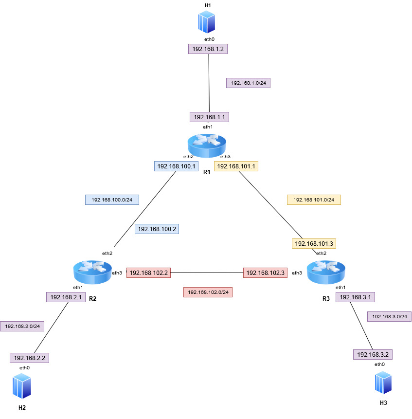

###Static Routing

Compile:

  p4c -b bmv2 router.p4 -o router.bvm2

Run:

  sudo python topology.py --behavioral-exe simple_switch --json router.bmv2/router.json

Install routing and switching tables:

  ./install_flow_rules.sh

Topology:

 
